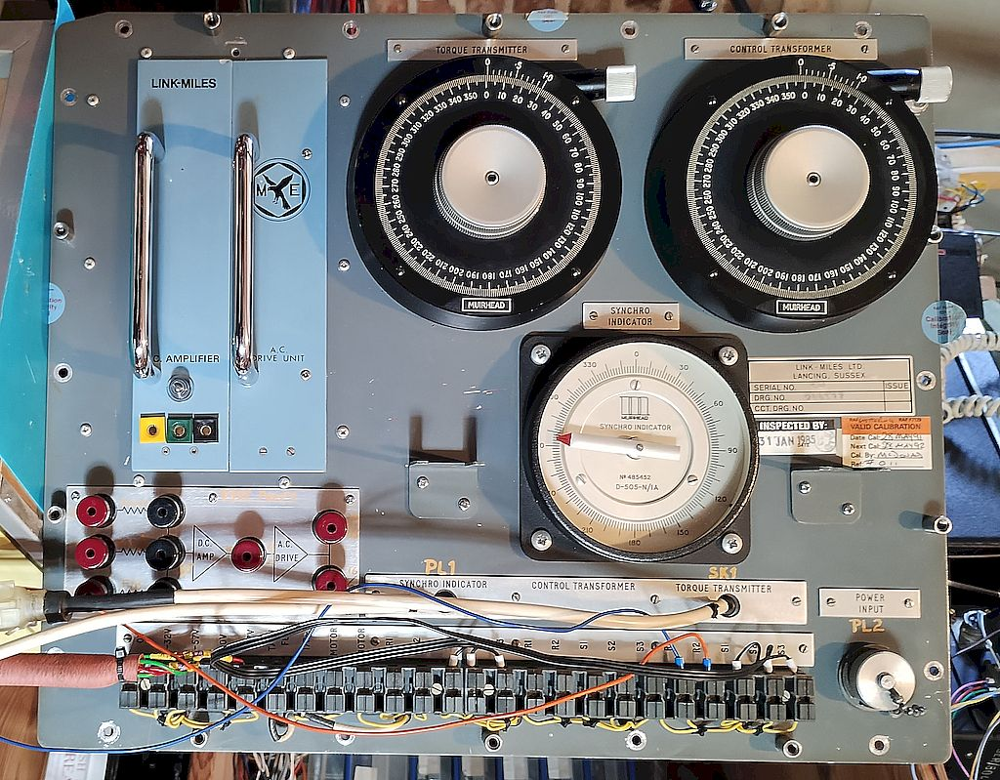
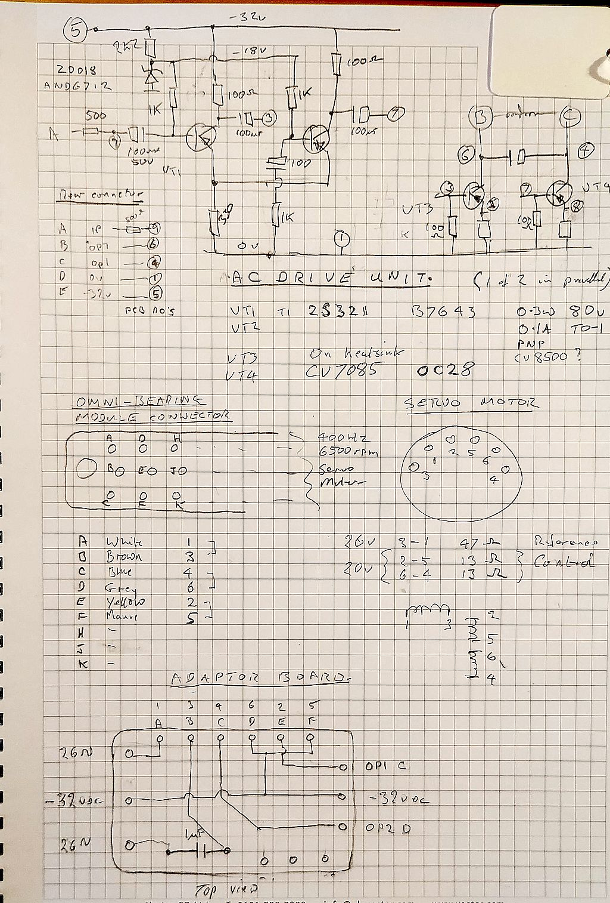

# Aviation_Synchro_Test_Set
Aircraft Synchro Test Set Unit * 966598 *

The unit consists of three synchro devices with their terminals brought out to push connectors on the front panel and some flyleads terminated in 9 way D connectors.

The Synchro units are:

 * Synchro Transmitter 26v11TX4b    - Vernier control input
 * Synchro Torque Receiver 26V.11TR4b - Display dial
 * Synchro Control Transformer 26V.11CT4c - Vernier control input

There are  two plug-in modules, a DC Amplifier the output of which is connected to an AC Drive unit.
The inputs to the DC amplifier are available on push connectors and 4mm jacks on the fron panel.

[Photos](./Images/README.md)

## AC Drive Unit

Initial testing has been to use the AC drive unit to rotate an AC servo motor with the amplifier input fed from the output of the control transformer to provide positive and negative phase 400 Hz inputs, reference winding fed through 90 phase shift capacitor.

## DC Amplifier

Not yet tested.